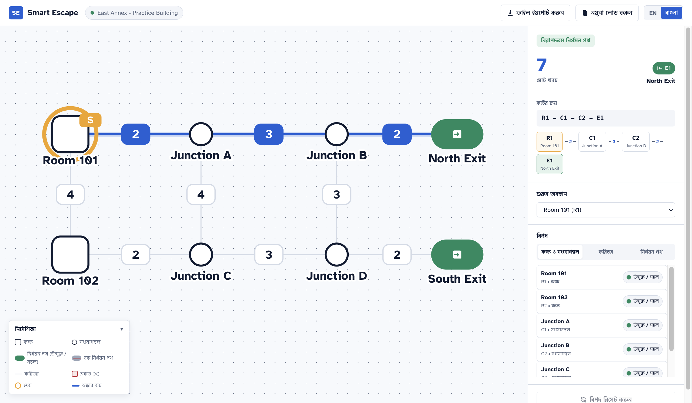
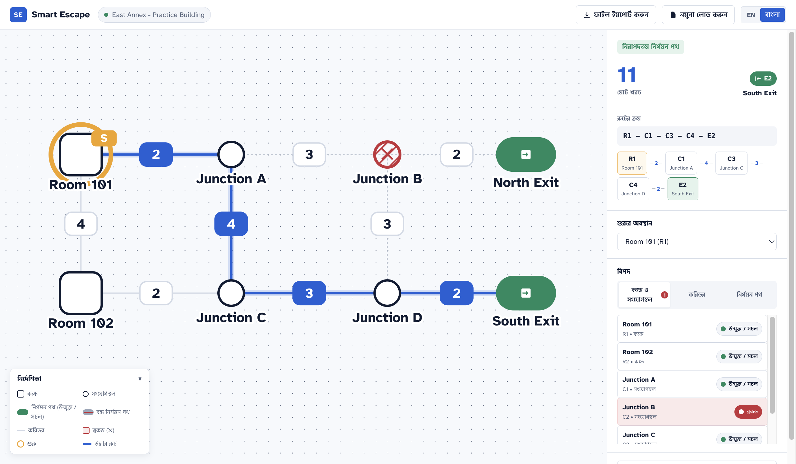

# Smart Escape: Interactive Evacuation Route Simulator

> An educational simulation web application that calculates and displays optimal evacuation routes under dynamic hazard conditions. Built for the AI DevFest timed competition.

## Identity & Submission Details
- **Participant Full Name:** Jahirun Hassan Rimon
- **Registration Number:** `rcmtugge5k004ndxknpnlqjb2x-`
- **Public GitHub Repository:** [https://github.com/jaherunhasanrimon/devfest--rcmtugge5k004ndxknpnlqjb2x-](https://github.com/jaherunhasanrimon/devfest--rcmtugge5k004ndxknpnlqjb2x-)
- **Public Live Website Link:** [https://jaherunhasanrimon.github.io/devfest--rcmtugge5k004ndxknpnlqjb2x-/](https://jaherunhasanrimon.github.io/devfest--rcmtugge5k004ndxknpnlqjb2x-/)

---

## Visual Demonstrations

### Baseline Evacuation Route (Room 101 to North Exit E1, Cost: 7)


### Dynamic Rerouting (After Blocking Junction C2, Route shifts to South Exit E2, Cost: 11)


---

## Running Instructions

### Prerequisites
- Node.js (v18+ recommended)
- npm (v9+ recommended)

### Setup & Execution Commands
```bash
# 1. Install dependencies
npm install

# 2. Start local development server
npm run dev

# 3. Run complete unit test suite (Vitest)
npm test

# 4. Compile and build production bundle
npm run build

# 5. Preview production build locally
npm run preview
```

---

## Implemented Features

### Core Evacuation Routing Engine
- **Deterministic Offline Dijkstra Algorithm:** Pure function in `src/core/route.ts` that calculates the least-cost path based exclusively on corridor edge weights (coordinates and hop counts are never used as costs).
- **Exact Code-Unit Tie-Breaking:** Evaluates exit ties using plain code-unit comparison (`a < b`, ensuring `'E10' < 'E2'`) and multi-path ties by choosing the lexicographically smallest node-ID sequence from start to exit.
- **Fail-Safe Route States:** Explicitly handles `idle`, `start_blocked` ("Starting location blocked"), `no_route` ("No route available"), and `route` states.

### Interactive SVG Map
- **Adaptive Vector Layout:** SVG `viewBox` dynamically adjusts to building coordinate bounds with consistent padding.
- **Semantic Element Styling:** Distinct geometry for rooms (rounded rect), junctions (circles), and exits (green pills with door glyphs).
- **Visual Hazard Indication:** Blocked rooms/junctions display diagonal hatch patterns with "✕" badges. Closed exits display grey fills with red crossbars. Corridors with blocked endpoints are rendered as unusable faded dashed lines.
- **Hero Route Ribbon:** High-contrast blue evacuation ribbon with soft glow halo and highlighted cost chips.

### Dynamic Hazard Simulation & State Control
- **Interactive Map Popovers & Side-Panel Switches:** Block/unblock rooms and junctions, toggle corridors, and close/reopen exits directly from the map or through dedicated side panel lists with active count badges.
- **Instant Recalculation:** Route updates synchronously on every hazard or start change without reimporting.
- **One-Click Reset:** Restores the dataset's exact `initial_state` while preserving the chosen start node if still valid.

### Strict Schema & Graph Validation
- Validates node and corridor limits (2–60 nodes, 1–150 edges), positive integer costs, absence of self-loops, and absence of duplicate undirected pairs.
- Validates references in `initial_state` (blocked nodes must be rooms/junctions; closed exits must be exits).
- Non-destructive import: Keeps the previously loaded building intact if an imported file fails validation, accompanied by a detailed localized error breakdown.

### Full Bilingual Localization (English & বাংলা)
- Native support for English and Bangla across all UI controls, statuses, legend descriptions, tooltips, and validation errors.
- Dynamic `<html lang>` sync and typography scale tailored for Bangla script rendering (`Hind Siliguri`).

### Accessibility & Motion
- All interactive controls accessible via keyboard navigation (`tabindex`, visible `:focus-visible` focus rings, and Enter/Space triggers).
- `aria-live="polite"` dynamic region for immediate screen reader status announcements.
- Full compliance with `prefers-reduced-motion: reduce`.

---

## Known Issues
- None identified. All 28 automated tests and manual UI checks pass with 0 errors.

---

## AI Tools & Disclosures
- **AI Tool Used:** Antigravity (Google DeepMind)
- **Most Useful AI Prompt:**
  > *"Execute Phase 0 and Phase 1 from docs/phases.md, then continue through the remaining phases following the protocol."*
